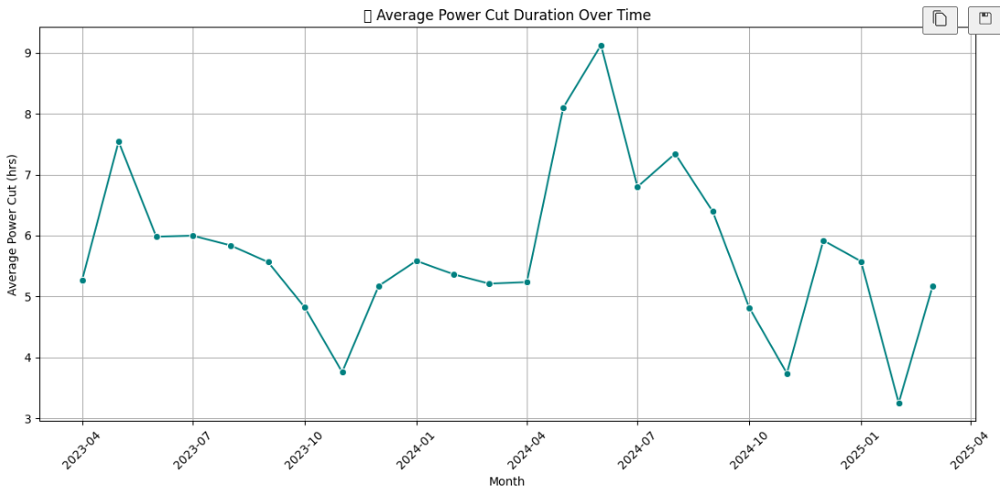
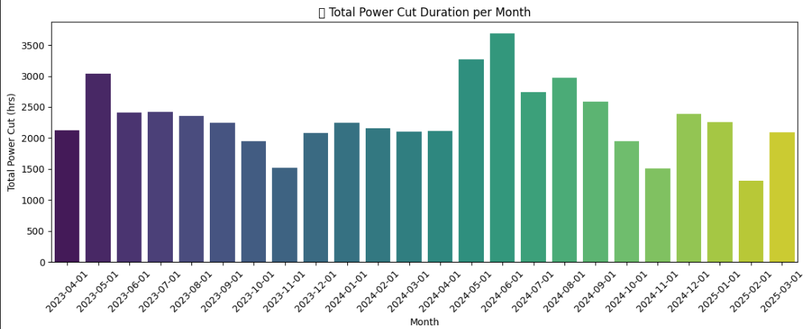
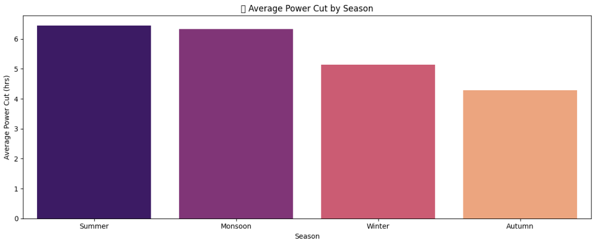
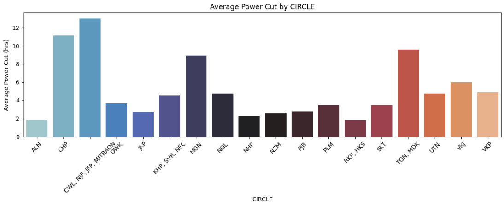
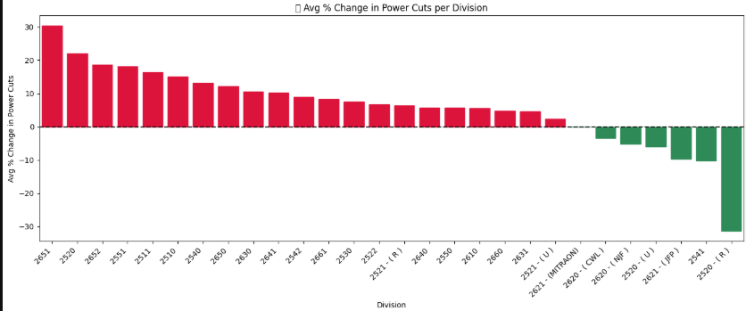
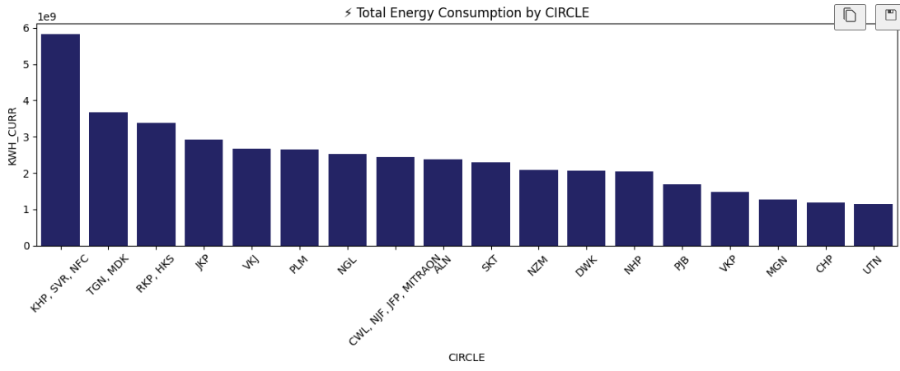
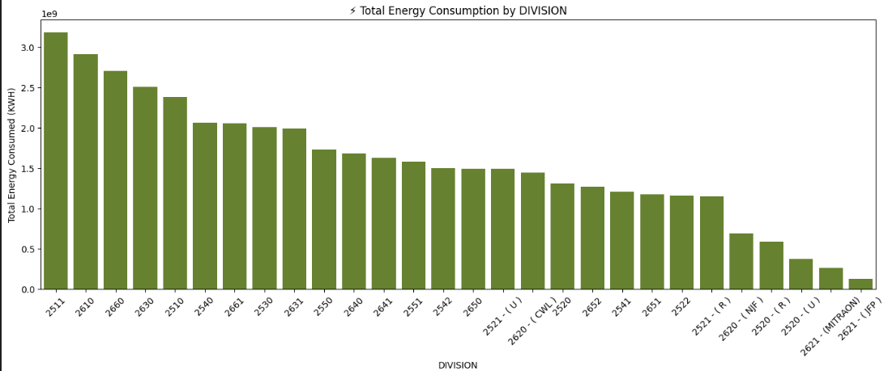
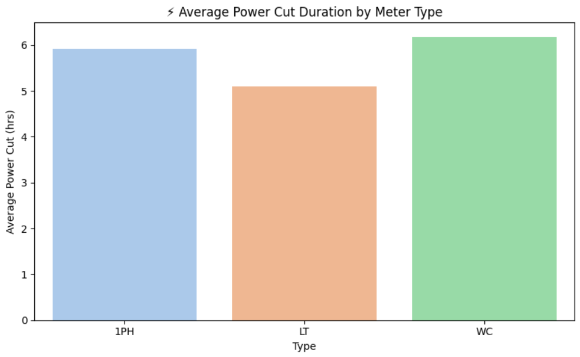
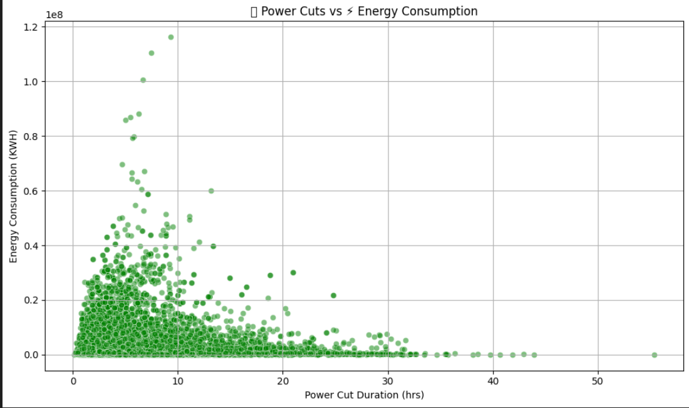

# Power Cut and Energy Analysis Dashboard

## 📊 Objective
To explore trends, causes, and infrastructure gaps in power supply using historical outage and consumption data.

## 📁 Dataset Details
- Records: 9684 rows after cleaning
- Key columns: Month, Meter Type, Circle, Division, Power Cut Hours, Energy Consumption (KWH), ESO Count

## 🔍 Key Insights
- Clear seasonality in power cuts (high in summer, low in winter)
- Division and circle-based discrepancies in performance
- Weak correlation between manpower and power reliability
- Meter type impacts both consumption and outage duration

## 📈 Recommended Graphs to Include

1. **Monthly Average Power Cut Trend** – Line Plot
   - 

2. **Total Power Cut Duration by Month** – Bar Plot
   - 

3. **Seasonal Power Cut Duration Comparison** – Box or Bar Plot
   - 

4. **Circle-wise Average Power Cuts** – Horizontal Bar
   - 

5. **PER_CHANGE by Division** – Colored Bar (green/red)
   -

6. **KWH Usage by Circle and Division** – Bar Plot
   - 
   - 

7. **Average Power Cut by Meter Type** – Bar Chart
   - 

8. **Correlation Heatmaps ** – POWEROFF_CURR vs KWH_CURR / ESO_CURR
   - 

📥 [Download Power BI Dashboard (PBIX)](https://drive.google.com/uc?export=download&id=1XrIpqIMj2-1fJAw337wHmjHkWAIYN5mD)

## 📁 Files Included
- main_analysis.ipynb
- powercut_summary_report.md
- images/
   - monthly_trend.png
   - division_change.png
   - meter_type_cut.png

## 🧠 Final Thoughts
Use these insights to build a robust outage forecasting tool or power reliability index per division.
